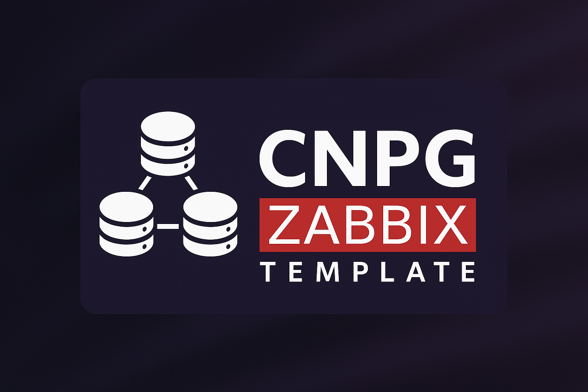
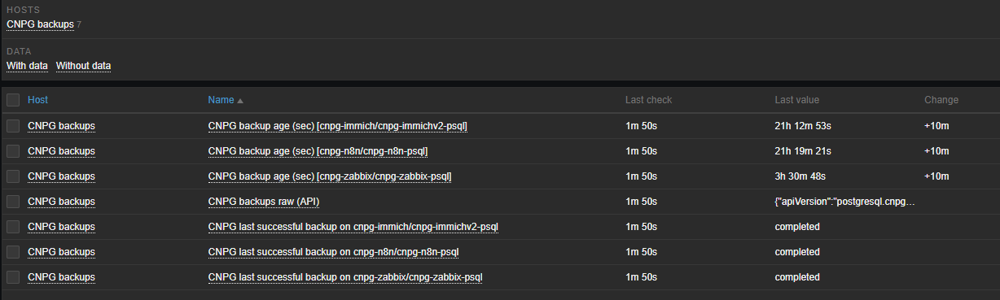

<p align="center">
  
</p>

# CNPG Backups Monitoring – Zabbix Template (API-based)

> **Zabbix Template for CloudNativePG (CNPG) Backups Monitoring on Kubernetes**  
> Automatic discovery of PostgreSQL CNPG clusters, backup monitoring, failure alerts, and backup age thresholds.


This Zabbix template provides full monitoring of **CloudNativePG (CNPG) backups** through the **Kubernetes API**, with no custom scripts required on cluster nodes.

## 🏗 Usage Context

- Kubernetes cluster hosting **multiple CNPG databases** across several namespaces.
- **Zabbix Agent deployed as a DaemonSet** for classic node/pod monitoring.
- This template **extends monitoring** by adding:
  - **Automatic discovery** of CNPG clusters and backups,
  - **Detailed backup checks** (status, failures, age),
  - Using **only the Kubernetes API** (HTTP Agent).

## Why use this template?

- Monitor CloudNativePG (CNPG) PostgreSQL backups on Kubernetes
- Full Zabbix 7.x integration
- Automatic discovery (LLD) of CNPG clusters
- Backup status (completed / failed / running)
- Backup age monitoring with configurable threshold
- Zero agents or scripts on Kubernetes nodes
- API-only monitoring for maximum reliability

## ✨ Features

### 🔍 Low-Level Discovery (LLD)

Backups are discovered via Kubernetes API:

```
GET /apis/postgresql.cnpg.io/v1/backups
```

Automatically extracted fields:

- `{#NS}` → CNPG namespace
- `{#CL}` → CNPG cluster name

Optional filtering: namespaces starting with `cnpg-*`.

## 📊 Automatically Created Items

For each discovered CNPG cluster:

- **`cnpg.backup.last_status[{#NS},{#CL}]`**  
  Last known backup status (`completed`, `failed`, `started`, `unknown`, …)

- **`cnpg.backup.age[{#NS},{#CL}]`**  
  Age (in seconds) of the **last successful backup**, or `0` if none has ever succeeded.

## 🚨 Included Triggers

For each cluster:

- ❌ **Backup FAILED** — status not `completed` or `started`.
- ⚠️ **Backup too old** — age exceeds `{$CNPG.BACKUP.MAXAGE}`.
- ⚠️ **No successful backup found** — no `completed` backup exists.

## ✅ Tested With

- **Kubernetes**: `v1.34`
- **Zabbix Server / Frontend**: `7.0.16`
- **CloudNativePG**: `ghcr.io/cloudnative-pg/cloudnative-pg:1.27.1`

## ⚙️ Required Kubernetes Permissions (RBAC)

```yaml
apiVersion: rbac.authorization.k8s.io/v1
kind: ClusterRole
metadata:
  name: zabbix-cnpg-backup-reader
rules:
  - apiGroups: ["postgresql.cnpg.io"]
    resources: ["backups", "scheduledbackups"]
    verbs: ["get", "list", "watch"]
---
apiVersion: rbac.authorization.k8s.io/v1
kind: ClusterRoleBinding
metadata:
  name: zabbix-cnpg-backup-reader
roleRef:
  apiGroup: rbac.authorization.k8s.io
  kind: ClusterRole
  name: zabbix-cnpg-backup-reader
subjects:
  - kind: ServiceAccount
    name: zabbix-service-account
    namespace: monitoring
```

Retrieve token:

```bash
kubectl -n <NAMESPACE> create token zabbix-service-account
```

Use in macro: `{$KUBE.API.TOKEN}`.

## 📦 Installation

### 1. Import the template

```
Configuration → Templates → Import
```

Import:

```
template_cnpg_backups_api.json
```

### 2. Assign to Kubernetes API host

Choose your existing "Kube API hosts" and assign it the template or create a new host with the macros below.
Macros to configure:

| Macro | Description |
|-------|-------------|
| `{$KUBE.API.URL}`   | Kubernetes API URL |
| `{$KUBE.API.TOKEN}` | ServiceAccount token |

## 🔧 Configurable Macros

| Macro | Description | Default |
|--------|-------------|----------|
| `{$CNPG.BACKUP.MAXAGE}` | Max age of last successful backup | `604800` |

## 📊 Expected Output

- Backup items visible in **Latest data**
- Alerts appear in **Problems** for failures/age/no-success

Example of **Lastest data**
<p align="center">
  
</p>


## 🤝 Contributing

Issues & PRs are welcome.

## 📜 License

Distributed under the **MIT License**.
See the `LICENSE` file.
